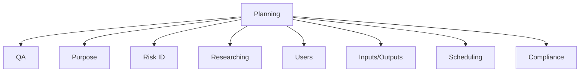
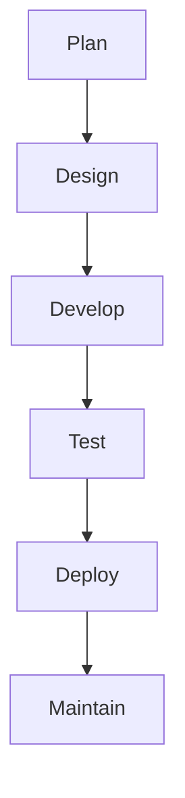
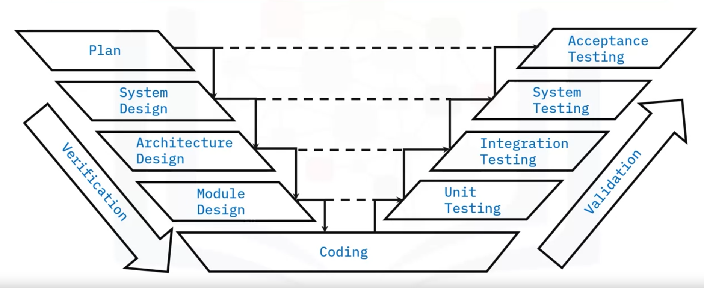
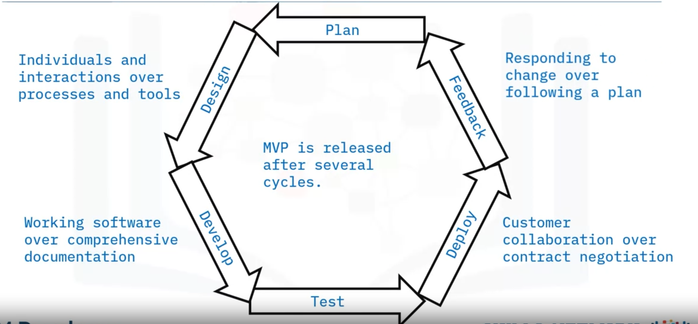
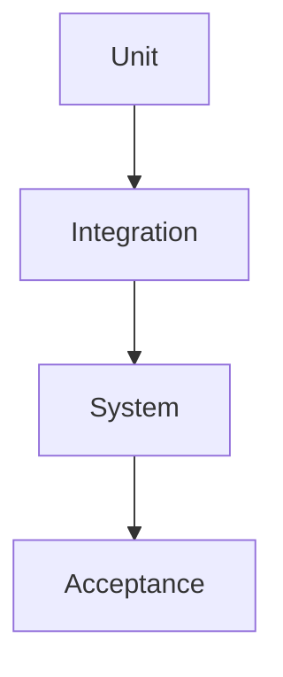
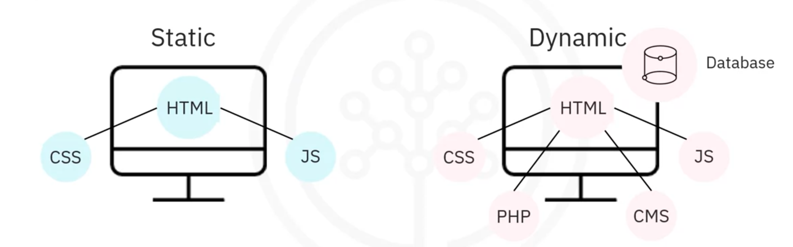

<center> <h1 style=color:red;> Introduction to Software Engineering </h1> </center>

<center> <h2> Module 1:  Overview of Software Engineering </h2> </center>

* **Software Engineering**: Software engineering is the systematic approach to the design and development software.

* **Responsibilities of a software engineer include**:
*  Designing, building, and maintaining software systems
* Writing and testing code.
* Consulting with stakeholders, third party vendors, security specialists, and other team members.
* Software engineers build systems while software developers implement specific functionalities.

<center> <h2 style=color:green;> Software Development Life Cycle (SDLC) </h2> </center>

* Systematic process to develop high- quality software
* Aims to produce software that meets requirements
* Defined phases with their own processes and deliverables
* Cycle of planning, design, and development
* Minimizes development risks and costs

<center> <h3 style=color:orange;> Advantage of the SDLC </h3> </center>

* Improves efficiency and reduce risks.
* Team members know what they should be working on and when.
* Facilitates communication among stakeholders.
* Team members knows when development can move to the next phase.
* Respond to changing requirements
* Solve problems early in the process
* Reduces overlapping responsibilities

<center> <h3 style=color:orange;> Phases of the SDLC </h3> </center>

* Organizations may have different names for each stage.
* Some organizations have more or fewer stages.

1. **Planning**
2. **Design**
3. **Development**
4. **Testing**
5. **Deployment**
6. **Maintenance**

### 1. **Planning**

* Gathered
* Analyzed
* Documented
* Prioritized



#### Prototyping
* Small-scale replica to clarify requirements.
* Tests design ideas.
* Can be developed at various stages of the SDLC.

#### Software Requirements Specification (SRS)
* Requirements are documented in the SRS
* All stakeholders must agree

### 2. **Design**

* **Requirements are gathered from the SRS to develop architecture**
* **Design Document.**

### 3. **Development**

* **Design Document**

### 4. **Testing**

* **Code is tested to ensure stability, security, and that it meets requirements from the SRS.**
* **Bugs reported, tracked, fixed, and retested.**


$$\text{Unit} \quad \text{Integration} \quad \text{System}  \quad \text{Acceptance}$$

### 5. **Deployment**

$$\text{Tested Code or Microservice} \rightarrow \text{User acceptance testing} \rightarrow \text{Production environment}$$

### 6. **Maintenance**

* **Other Bugs**
* **User Interface Issues**
* **New and Changing requirements**
* **Code enhancements**

<center> <h3 style=color:orange;> Building Quality Software </h3> </center>

#### Common Software Engineering Processes

1. **Requirements gathering**
* The software requirements specification (SRS) encompasses the process of collecting and documenting the set of requirements that the software needs to adhere to.
• It may include a set of use  cases that describe the business needs and user flows that the software must implement.

2. **Design**
*  Transforming requirements into code
* Breaking down requirements into sets of related components
* Communicating business rules and application logic

3. **Coding for quality**
Quality code must fulfill the intended requirements of the software without defects
* Clean and consistent
* Easy to read and maintain
* Well documented
* Efficient

Coding for quality entails following a set of coding practices during development
* Following coding standards
* Using linters to detect errors
* Commenting in the code itself to make it easy to understand and modify.

4. **Testing**
The process of verifying that the software matches established requirements and is free of bugs
* Identify errors, gaps, or missing requirements
* Ensures reliability, security, performance, and efficiency
* Software testing can often be automated or done manually
* Unit testing
* Integration testing
* System testing
* User Acceptance Testing (UAT) or Beta testing

5. **Releases**

| **Alpha $(\alpha)$**           | **Beta $(\beta)$** | **General Availability $(GA)$** |
| ------------------------------ | ------------------ | ------------------------------- |
| Select stakeholders.           | All stakeholders   | Stable                          |
| May contain errors.            | User testing       | All Users                       |
| Preview of functioning version | Meets requirements |                                 |
| Design changes may occur       |                    |                                 |


6. **Documenting**

* **System documentation**
README files, inline comments, architecture and design documents, verification information and maintenance guides

* **User documentation**
User guides, instructional videos, manuals, online and inline help

#### Steps to Gathering Requirements

1. **Identifying stakeholders**
**Key Personal**
* Decision-makers
* End-users
* System administrators
* Engineering
* Marketing
* Sales
* Customer support

2. **Establishing goals and objectives**
* **Goals**: broad, long-term achievable outcomes
* **Objectives**: actionable, measurable actions that achieve the goal

3. **Eliciting requirements from the stakeholders**
* Elicit
    * Surveys
    * Questionnaires
    * Interviews
* Document
    * Align with goals and objectives
    * Easily understood
* Confirm
    * Consistency
    * Clarity
    * Completeness
* Prioritizing
    * Must-haves
    * Highly desired
    * Nice to have

4. **Documenting the requirements**
* ***Software requirements specification (SRS)***
    * Captures functionalities the software should perform
    * Establishes benchmarks / service-levels for
performance
    * Purpose and scope
    * Constraints, assumptions, dependencies
    * Requirements
        * Functional
        * External interface
        * System features
    * Purpose
        * Who has access to the SRS
        * How it should be used
    * Scope
        * Software benefits
        * Goals
        * Objectives
    * *Constraints*: how the software must operate under given conditions
    * *Assumptions*: required 0S or hardware
    * *Dependencies*: on other software products

    * Requirements
        * *Functional*: functions of the software
        * *External*: users and interactions with other hardware or software
        * *System features*: functions of the system
        * *Non-functional*: performance, safety, security, quality

* ***User requirements specification (URS)***
    * Describe business need and end-user expectations
    * User stories:
        * Who is the user?
        * What is the function that needs to be performed?
        * Why does the user want this functionality?
    * Confirmed during user acceptance testing
    * Often combined into the SRS


* ***System requirements specification (SysRS)***
    * Outlines requirements of the system
    * Broader than an SRS
    * Contains:
        * System capabilities
        * Interfaces and user characteristics
        * Policy
        * Regulation
        * Personnel
        * Performance
        * Security
        * System acceptance criteria
        * Hardware expectations

5. **Analyzing and confirming the requirements**

<center> <h2> Module 1:  The Software Building Process and Associated Roles </h2> </center>

### Software Development Methodology

***Software Development Methodology***: A process is needed to clarity communication and facilitate information sharing among team members.

**Common Software Development Methodology**
1. **Waterfall**
2. **V-Shape Model** 
3. **Agile**

### 1. **Waterfall**



| **Pros** |  **Cons** |
| -------- | --------- |
| Team members understand their responsibilities due to discrete, well-defined stages. | Lacks flexibility|
| Easier to estimate budget and allocate resources. | Change is hard to accommodate. |

### 2. **V-Shape Model** 



| **Pros** |  **Cons** |
| -------- | --------- |
| Easy to use | Redge |
| Test plans designed upfront saves development and testing time. | Does not accommodate changing requirements |

### 3. **Agile**



| **Pros** |  **Cons** |
| -------- | --------- |
| Changing requirements handled easily. | Budgeting and resource allocation is challenging. |
| Feedback incorporated regularly | Project scope not clearly defined. |

#### Sequential VS Iterative

* **`Sequential` : Waterfall and V-Shaped Model**
* **`Iterative`: Agile**

### Software Versions

* Software versions are identified by version numbers
* Version numbers indicate:
    * When the software was released
    * When it was updated
* If any minor changes or fixes were made to the software
* Software developers use versioning to keep track of new software, updates, and patches
* Version numbers can be short or long with 2, 3 or 4 sets.
* Each number set is divided by a period.
* An application with a 1.0 version number indicates the first release.
* Software with many releases and updates will have a larger number.
* Some use dates for versioning, such as Ubuntu Linux version 18.04.2 release in 2018 April, with a change shown in the third number set.

**What do version numbers mean?**
Some version numbers follow the semantic numbering system and have 4 parts separated by a period like: **`version 9.1.33.6`**
* The first number indicates major changes to the software, such as a new release
* The second number indicates that minor changes were made to a piece of software
* The third number in the version number indicates patches or minor bug fixes
* The fourth number indicates build numbers, build dates, and less significant changes

**Version Compatibility**
* Older versions may not work as well in newer versions
* Compatibility with old and new versions of software is a common problem.
* Troubleshoot compatibility issues by viewing the software version.
* U date software to a newer version tRat is compatible.
* Backwards-compatible software functions properly with older versions of files, programs, and systems.

### Software Testing

* Integrate quality checks throughout SDLC.
* Purpose:
    * Ensure software meets requirements.
    * Error-free software.
* Test Cases
    * Verify functionality and requirements
        * Steps
        * Data
        * Inputs
        * Expected Outputs

***Three Types of Software Testing***
1. **Functionality Testing**
2. **Non-Functionality Testing**
3. **Regression Testing**

#### 1. **Functionality Testing**

```plaintext
                  ___________
Input ---------> | Black Box | -------> Output
                 |___________|
               System Under Test
```
**How to do Functionality Testing**
* Manually
* Automated

**Purpose of Functionality Testing**
* Usability
* Accessibility

#### 2. **Non-Functionality Testing**

**Non-Functionality Testing Attributes**
* Performance
* Security
* Availability
* Scalability

**Non-Functionality Testing Questions**
* How does the application behave under stress?
* What happens when many users log in at the same time?
* Are instructions consistent with behavior?
* How does the application behave under different OSs?
* How does the application handle disaster recovery?
* How secure is the application?

#### 3. **Regression Testing**

* Confirms changes don't break the application.
* Occurs after fixes such as a change in requirements or when defects are fixed.

**Choosing test cases for regression testing**
* *Choose test cases that contain:*
    * Frequent Defects
    * Frequently used functionality
    * Features with recent changes
    * Randomly successful or failed cases
    * Edge cases
    * Complex cases

#### Testing Levels



#### Unit Testing
* Test a module of code
* Occurs during the build phase of the SDLC
* Eliminate errors before integration with other modules

### Integration Testing

* Identify errors introduced when two or more modules are combined.
* Type of black-box test.
* Occurs after modules are combined into the larger application.
* **Purpose of Integration Testing**
    * New Module 
    * Other Module
    * Hardware
    * Database
* **System Testing**
    * Compliance with SRS
    * Functional and Non-Functional
    * Validate the System
    * Staging Environment
* **Acceptance Testing**
    * Users
    * Customers
    * Stakeholders

### Software Documentation

**Product vs Process Documentation**

1. **Product Documentation**: Relates to product functionality.
2. **Process Documentation**: Describe how to complete a task.

#### 1. **Product Documentation**

* **Types of Product Documentation**
* i. **Requirements Documentation**: Intended for the development team including developers, architects, and QA. Describes expected features and functionality
    * Software requirements specifications
    * System requirements specification
    * User acceptance specifications

* ii. **Design Documentation**: Written by architects and development team to explain how the software will be built to meet requirements.
    * Consists of both conceptual
    * Technical design documents

* iii. **Technical Documentation**: Written in the code to help developers read the code.
    * Comments embedded in code and working papers that explain how the code works.
    * Documents that record ideas and thoughts during implementation.

* iv. **Quality Assurance Documentation**: Pertains to the testing team's strategy progress, and metrics
    * Test plans
    * Test data
    * Test scenarios
    * Test cases 
    * Test strategies 
    * Traceability matrices

* v. **User Documentation**: Intended for end-users to explain how to operate software or help install and troubleshoot system.
    * FAQs
    * Installation 
    * Help guides
    * Tutorials
    * User Manuals

#### 2. **Process Documentation**

**Standard Operating Procedures**
* Accompanies process documentation
* Step-by-step instructions on how to accomplish common yet complex tasks
* Ex: organization specific instructions for check in code to a repository
* Types of SOPs:
    * Flowcharts
    * Hierarchical
    * Step-by-step

**Updating Documentation**
* Must be kept up to date.
* Documentation should be reviewed and updated periodically.

### Roles in Software Engineering Projects

1. Project manager / Scrum master
2. Stakeholder
3. System / Software architect
4. UX Designer
5. Developer
6. Tester / QA engineer
7. Site reliability / Ops engineer
8. Product manager / Product owner
9. Technical writer / Information developer


* 1. ***Project manager vs Scrum master***

| **Project Manager** | **Scrum Master** |
| ------------------- | ---------------- |
| Planning, scheduling, and budgeting.| Ensure team success. |
| Allocating personnel and resources | Individual success |
| Executing the software plan | Prioritize people over process |
| Team communication | Focused on facilitating communication between all team members |

* 2. ***Stakeholder***
* Interested parties who are affected by the software product
* Customer, end-users, decision-maker
* Responsibilities :
    * Defines requirements
    * Provides feedback on requirements implementation
    * May participate in beta and acceptance testing

* 3. ***System Architect***
* Designs, describes, and communicates rchitecture of a project to team members
* Responsibilities :
    * Designs inner structure
    * Designs technical aspects
    * Provides technical support regarding the architecture

* 4. ***UX Designer***
* Balances making software interface intuitive yet also robust.
* Responsibilities :
    * How software communicates functionality to the user.
    * How the user interacts with the software.

* 5. ***Developer***
* Writes the code that powers the software.
* Responsibilities :
    * Implement architecture in design documents.
    * Incorporate SRS requirements.
    * EmployUX design

* 6. ***Tester / QA Engineer***
* Ensures quality of the product by testing to see if the software meets requirements
* Responsibilities :
    * Writes and execute test cases
    * Provides feedback to development teams

* 7. Site Reliability Engineer
* Bridges software development and operations
* Responsibilities :
    * Tracks and communicates incidents
    * Automates systems, procedures, and processes
    * Trouble shoot

* 8. ***Product Manager / Product Owner**
* Understands requirements and end-user needs
* Responsibilities :
    * Leads development efforts
    * Ensures product provides value to the customer

* 9. ***Technical Writer / Information Developer**
* Writes documentation for end-user
* Technical material $\rightarrow$ Non—technical audience
* Responsibilities :
    * Writes user manuals
    * Writes reports
    * Writes white papers
    * Writes press releases

<center> <h3 style=color:orange;> Summary & Highlights </h3> </center>

Congratulations! You have completed this module. At this point, you know: 

* Software engineering is the application of scientific principles to the design and creation of software. 
* Responsibilities of a software engineer include designing, building, and maintaining software systems.  
* Using the SDLC can improve efficiency and reduce risks by:  
    * letting team members know what they should be working on and when  
    * facilitating communication between the customer, other stakeholders, and the development team 
    * letting stakeholders know where they fit into that process  
    * letting cross-domain teams know when they have completed their tasks so development can move to the next phase.   
* Common software engineering processes are requirements gathering, design, coding, testing, releasing, and documenting. 
* The requirement gathering process entails identifying stakeholders, establishing goals and objectives, eliciting requirements from the stakeholders, documenting the requirements, analyzing, prioritizing, and confirming the requirements. 
* An SRS is a document that captures the functionalities that the software should perform and also establishes benchmarks or service levels for its performance. 
* A URS is a subset of the SRS that details user specification requirements. 
* The SysRS contains the same information as an SRS, but can also additionally include system capabilities, interfaces, and user characteristics, policy requirements, regulation requirements, personnel requirements, performance requirements, security requirements, and system acceptance criteria. 
* Waterfall, V-shape model, and agile are all different methodologies for implementing the software development life cycle. 
* Functional testing is concerned with inputs and corresponding outputs of the system under test, non-functional testing tests for attributes such as performance, security, scalability, and availability. Whereas regression testing confirms that a recent change to the application, such as a bug fix, does not adversely affect already existing functionality. 
* Types of documentation include requirements, design, technical, quality assurance, and user. 
* There are many different roles involved in a software engineering project. Some of them include project manager or scrum master, stakeholder, system or software architect, UX designer, software developer, tester or QA engineer, site reliability or Ops engineer, product manager or owner, and technical writer or information developer. 


<center> <h2> Module 2:  Introduction to Development </h2> </center>

### Basics of Website Interaction

The server will return:
* HTML defines the structure and content of the page.
* CSS add style and flair to the page.
* JavaScript adds  interactivity and dynamic content.
* Contents displayed by websites contain elements that are either:

Most website use a combination of static and dynamic content.

***Cloud Application***
* Built to work seamlessly with a Cloud-based back-end infrastructure.
* Cloud-based data storage and data processing, and other Cloud services, making them scalable and resilient.

***Building website and Cloud Application***
* The environment is divided into two primary areas:
1. **Front-End**
> * Deals with everything that happens at the client-side.
> * Specializes in front-end coding, using HTML, CSS< JavaScript and related frameworks, libraries, and tools.

2. **Back-End**
> * Deals with the server before the code and data are sent to the client.
> * Handles the logic and functionality and the authentication processes that keep data.
> * Back-end developers may also work with relational or NoSQL databases.


Full-stack developers have skills, knowledge, and experience in both front-end and back-end environments.

* To create a website, web developers usually use:
    * Hypertext Markup Language (HTML)
        * HTML is used to create the physical structure of a website with:
            * Text
            * Links
            * Images/Videos
            * Page Dividers
            * Buttons
    * Cascading Style Sheets (CSS)
        * CSS provides front-end developers with a standard method to define apply, and manage different sets of style characteristics for a website and each of its components.
        * CSS ensures uniformity in look and feel, style, colors, fonts, designs and layouts.
    * JavaScript
        * JS is an object-oriented programming language that is used in conjunction with HTML and CSS to add interactivity to a website.

***APIs, Routing, Endpoints :**
* APIs, routes, and endpoints process requests from the front-end
    * API is a code that works with data
    * Route is a path to a website or page
    * Endpoint can be an API or route
* Back-end developers create routes to direct requests to the correct service
* APIs provide a way for Cloud Apps to access resources from the back-end.

<center> <h2> Module 2:  Tools in Software Development </h2> </center>

### ***Application Development Tools***

A cloud application developer's workbench includes:
* **Version Control**
* Keeps track of:
    * What changes were made
    * When they were made
    * Who made them
* Resolves change conflicts
* Provides a way to revert to an older version
* Examples:
    * Git
    * GitHub

* **Libraries**
* Collections of reusable code
* Multiple code libraries can be integrated into a project
* Codes can be called when required
* Can solve specific problems or add specific features
* Example
    * jQuery is a JavaScript library that simplifies DOM manipulation
    * Email-validator checks if email address is correctly constructed and valid
    * Apache Commons Proper is a repository of reusable Java components

* **Frameworks**
* Provides a standard way to build and deploy applications
* Acts as a skeleton you extend by adding your own code
* Should be determined and used from the beginning
* Dictates the architecture of the app
* Calls your code
* Allows you less control than libraries.
* Examples
    * AngularJS is a JavaScript-based framework for dynamic web applications
    * Vue.js is a JavaScript framework focused on the user interface
    * Django/Flask is a framework that uses Python for web development

***Application developer's tools**
A cloud application developer's workbench includes:
* **CI/CD**
    * Continuous Integration with Continuous Delivery or Continuous Deployment
    * Enables developers to deliver frequent changes reliably
    * Implemented through a build-automation server
    * CI automatically builds and tests code
    * CD deploys the changes

* **Build Tools**
* Transform source code into binaries for installation
* Important in environments with many inter-connected projects and multiple developers
* Automate tasks like:
    * Downloading dependencies
    * Compiling source code into binary code
    * Packaging that binary code
    * Running tests
    * Deployment to production systems
* Initiate a building from the command line or from an IDE.
* Two categories that are widely used:
    * Build-automation utilities.
    * Build-automation servers.
* Examples:
    * Webpack is a module bundler for JavaScript
    * Babel is a JavaScript compiler
    * Web Assembly is a binary instruction format that runs in your browser.

* **Packages**
* Packages make apps easy to install.
* Package contains
    * App files
    * Instructions for installation
    * Metadata

* **Package Managers**
* Make working with packages easier
* Coordinate with file archivers to extract package archives
* Verify checksums and digital certificates to ensure the integrity and authenticity of the package
* Locate, download, install, or update existing software from a software repository
* Manage dependencies to ensure a package is installed with all packages it requires

* **Package managers by platform**
Some commonly used package managers for the major platforms are listed here:
    * On Linux
        * Debian Package Management System (DPKG)
        Red Hat Package Manager (RPM)
    * On Windows
        * Chocolatey
    * On Android
        * Package Manager
    * On MacOS
        * Homebrew
        * MacPorts

* Libraries and utility code are managed with the cloud application package managers

| **Node.js/JavaScript** | **Java** | **Ruby** | **Python** |
| ---------------------- | -------- | -------- | ---------- |
| npm |                  | Gradle   | RubyGems | pip        |
|     |                  | Maven    |          | conda      |

### Introduction to Software Stacks

**What is a software stack?**
* Combination of technologies
* Used for creating applications and solutions
* Stacked in a hierarchy to support the application from user to computer hardware
* Typically include:
    * Front-end technologies
    * Back-end technologies

| **Parts of a Software Stack** |
| ----------------------------- |
| Presentation                  |
| Logic Layer                   |
| Data Layer                    |
| Security                      |
| Virtualization                |
| Orchestration                 |

* **Sources**:
    * Internal
    * Third Party
    * Cloud

* **Can Use**:
    * All of a stack
    * Parts of a stack

* **Example of Software Stacks**
    * Python-Django
    * Ruby on Rails
    * ASP .NET
    * LAMP (Linux, Apache, PostgreSQL, Python)
    * MEAN (MongoDB, Express.js, Angular.js, Node.js)
    * MEVN (MongoDB, Express.js, Vue.js, Node.js)
    * MERN (MongoDB, Express.js, React, Node.js)

**Comparison of MEAN, MEVN, and LAMP**
* **MEAN**
    * All parts use JavaScript- one language to learn
    * Lots of documentation and reusable code
    * Not suited to large-scale applications or relational data
* **MEVN**
    * Similar to MEAN
    * Less reusable libraries
* **LAMP**
    * Lots of reusable code and support
    * Only on Linux

<center> <h3 style=color:orange;> Summary & Highlights </h3> </center>

Congratulations! You have completed this module. At this point, you know: 

* How websites are built and displayed, and how they communicate with the back-end servers. 
* How different front-end technologies work together to create reactive and responsive websites. 
* How back-end development covers a wide range of technologies including business logic, security, and database access. 
* Effective teamwork can result in better quality code with fewer bugs, better-skilled team members, and less stress for everyone. 
* Pair programming is a great way to share knowledge and skills between developers, resulting in better solutions and improved efficiency. 
* You can use developer tools to track who makes what changes to your code withversion control software, access libraries of reusable code, and use frameworks to build and deploy applications in a standard way. 
* CI/CD tools, build tools, packages, and package managers help you build and distribute your applications. 
* A software stack is a combination of technologies for creating applications and solutions.


<center> <h2> Module 3: Programming Language and Organization </h2> </center>

**What are programming language?**

* Help us tell computers what to do 
* Computer language is called machine code
* Machines understand binary, Is and 0s
* Human-readable programming languages communicate with computers

* Common programming languages categories:
    * Interpreted
    * Compiled
* Many programming languages are compiled languages and interpreted languages
* The developer determines which language is best suited for the project

**Interpreted Programming**
* Scripted or scripting language.
* Operates through the interpreter on your computer or browser
* Translates human-readable scripted code to machine code
* The computer completes the task
* Some interpreted programming languages are outdated
* Some are more versatile and easier to learn languages
* Interpreted programming languages need an interpreter to translate the source code
* Translators are built into the browser or require a program on your computer to interpret the code

**Compiled Programming**
* Programs that you run on your computer
* Packaged or compiled into one file
* Usually larger programs
* Used to help solve more challenging problems, like interpreting source code

* **High-level programming languages**
    * More sophisticated
    * Use common English
    * SQL, Pascal, Python

* **Low-level programming languages**
    * Use simple symbols to represent machine code
    * ARM, MIPS, X86

**Query languages**
* A query is a request for information from a database
* The database searches its tables for information requested and returns results
* Important that both the user application making the query and the database handling the query are speaking the same language
* Writing a query means using predefined and understandable instructions to make the request to a database
* Achieved using programmatic code (query language/ database query language)

**Flowcharts**
* Graphical or pictorial representation of an algorithm
* Symbols, shapes, and arrows in different colors to demo a process or program
* Analyze different methods of solving a problem or completing a process
* Standard symbols to highlight elements and relationships

**Pseudocode**
* Simply explains each line of code
* Focuses more on logic
* Code development stage is easier
* Words/ phrases represent lines of computer operations
* Simplifies translation to code
* Code in different computer languages

<center> <h3 style=color:orange;> Summary & Highlights </h3> </center>

Congratulations! You have completed this module. At this point, you know: 

* Interpreted programming languages create source code that runs through an interpreter and is built into your operating system (OS) on your computer or on your web browser. 
* Compiled programming languages create executable files that are grouped in programs on your computer or device.  
* Query languages, structured programming languages, and object-oriented programming languages are categorized as high-level programming languages and assembly languages are categorized as low-level programming languages.  
* The two main methods of organizing and planning code are by developing flowcharts and by writing pseudocode. Flowcharts are pictorial representations of algorithms and pseudocode is an explanation of the function of each line of a program. 
* To reference a program component, software developers use an identifier, which can either be a constant or a variable.  
* A function is a piece of structured, stand-alone, and reusable code that will perform a single specific action.  
* Object-oriented programming is a programming methodology that is focused on objects rather than functions.  

<center> <h2> Module 4: Software Architecture and Design </h2> </center>

***Software Design and Architecture***
* Design and documentation take place during the design phase of the SDLC
* Software architecture is the organization of the system
* Serves as a blueprint for developers
* Comprised of fundamental structures and behaviors

***Early Design Decisions***
* How components interact
* Operating environment
* Design principles
* Costly to change once implemented
* Addresses non-functional aspects

***Wht software architecture is important***
* Communication
* Earliest design decision
* Flexibility
* Increases lifespan

***Software architecture and tech stacks**
* Guides technology stack choice
* Tech stacks must address non-functional capabilities
* Tech stacks include:
    * Software
    * Programming languages
    * Libraries
    * Frameworks
* Architects must weigh advantages and disadvantages of tech stack choices

***Artifacts***
1. **Software Design Document (SDD)**
* Collection of tech specs regarding design implementation
* Design considerations:
    * Assumptions
    * Dependencies
    * Constraints
    * Requirements
    * Objectives
    * Methodologies

2. **Architectural Diagram**
* Displays
    * Components
    * Interactions
    * Constraints
    * Confines
    * Architectural Patterns 

3. **Unified Modeling Language (UML) Diagram**
* Visually communication structures and behaviors
* Not constrained by a programming language

***Deployment Considerations***
* Architecture drives production environment choices
* Production environment is the infrastructure that runs and delivers the software

***Software Design and Modeling***

**Software Design**
Software design is a process to document:
    * Structural components
    * Behavioral attributes
Models express software design using:
    * Diagrams and flowcharts
    * Unified Modeling Language (UML)

***Behavioral Models**
* Describe what a system does but does not explain how it does it
* Communicate the behavior of the system
* Many types of behavioral UML diagrams
    * State transition
    * Interaction

***UML Diagrams***
* Visual representations to communicate architecture, design, and implementation
* Two types: structural and behavioral
* Programming language agnostic

***Object-Oriented Language***
* A patient could be an object.
* An object contains data, and an object can perform actions.
* Languages: *Python, Java, C++*

<center> <h2> Module 4: Software Architecture Patterns and Deployment Topologies </h2> </center>

***What is a component?***
* An individual unit of encapsulated functionality.
* Serves as a part of an application in conjunction with other components.

***Component  Characteristics***
* *Reusable* : Reused in different applications.
* *Replaceable* : Easily replaced with another component.
* *Independent* : Doesn't have dependencies on other components.
* *Extensible* : Add behavior without changing other components.
* *Encapsulated* : Doesn't expose its specific implementation.
* *Non-context specific* : Operates in different environments.

***Component Examples***
* API
* Data Access Object
* Controller

***Component-based architecture***
* Decomposes design into logical components
* Higher level abstraction than objects
* Defines, composes, and implements loosely coupled independent components so they work together to create an application.

***Services***
* Designed to be deployed independently and reused by multiple systems
* Solution to a business need
* Has one unique, always running instance with whom multiple clients communicate.

***Distributed systems***
* Multiple services located on different machines.
* Services coordinate interactions via a communication protocol such as HTTP
* Appears to the end-user as a single coherent system

***Distributed System Characteristics***
* Shares resources
* Fault-tolerant
* Multiple activities run concurrently
* Scalable
* Runs on a variety of computers
* Programmed in a variety of languages

***Nodes***
* Any device on a network that can recognize, process, and transmit data to other nodes on the network.
* Distributed systems have multiple interconnected nodes running services.

***Distributed Systems Architecture***
* Client-Server
* Peer-to-peer
* Three-tier
* Microservices

***Types of Architectural Patterns***
* 2-tier
* 3-tier
* Peer-to-peer
* Event-driven
* Microservices
* Model-view-controller
* Message-broker
* Blackboard
* Pipe-filter
* Controller-responder

***Production Deployment Components***

* **Firewall**
    * Monitors traffic between an interior and an exterior network
    * Permits or blocks data based on a set of security rules
    * Acts as a barrier between networks to block viruses and hackers from accessing the internal network

* **Load Balancers**
    * Purpose: distributes traffic efficiently amongst multiple servers
    * Functions :
        * Prevents server traffic overload
        * Maximizes server capabilities and responsiveness
        * Ensures no one server is overworked
        * Manages concurrent requests fast and reliably

* **Web and Application Servers**
    * *Servers*
        * Provide services, resources, data, or applications to a client
        * Store, process, and manage network data, devices, and systems
    * *Web Servers*
        * Delivers web pages, files, images, and videos to the client
        * Responds to HTTP requests from a browser
    * *App Servers*
        * Runs the apps and provides the app to the client or the web server
        * Stores code that determines how data can be created, stored, or changed

* **Proxy server**
    * An intermediate server that handles requests between two tiers
    * Can be used for load balancing, system optimization, caching, as a firewall, obscuring the source of a request, encrypting messages, scanning for malware, and more
    * Can improve efficiency, privacy, and security

* **Databases and Database**
    * Databases are a collection of related data stored on a computer that can be accessed in various ways
    * DBMS controls a database by connecting it to users or other programs
    * Database servers control the flow and storage of data servers

<center> <h3 style=color:orange;> Summary & Highlights </h3> </center>

* Congratulations! You have completed this module. At this point, you know that: 
* Software architecture functions as a blueprint and represents the importance of a good architectural design. 
* Structured design breaks down a software problem into well-organized smaller solution elements whereas behavioral models describe the behavior of the system without explaining how the system implements the behavior. 
* Developing UML diagrams saves time and money by helping developers quickly get up to speed on a project, plan features in advance of coding, and navigate source code easily. Types of UML diagrams include state transition, interaction, and class diagrams.  
* Objects contain data, and they also have behaviors that prescribe the actions the object can take, whereas classes are blueprints for objects.  
* A service-oriented architecture (SOA) consists of loosely coupled services that interface with each other via a communication protocol over a network. Distributed systems run on multiple services on different machines, but they appear to the end-user as a single coherent system. 
* An architectural pattern is a repeatable solution to an architectural problem. Types of architectural patterns include 2-tier, 3-tier, event-driven, peer-to-peer, and microservices. Two or more patterns can be combined in a single system, but some are mutually exclusive.  
* Application environments include development, testing or QA, staging, and production. Production environments tend to be more complex than pre-production because they must take into account non-functional requirements like load, security, reliability, and scalability.  
* Application environments can be deployed either on-premises on traditional hardware, or on public, private, or hybrid cloud platforms. 
* Common components needed for a production environment include a firewall, a load balancer, web and application servers, proxy servers, and database servers. 

<center> <h2> Module 5: About Software Engineers </h2> </center>

***Software Engineering***

* Engineering
* Mathematics
* Computing

***Types of Software***

* Desktop and Web Application
* Mobile Apps
* Games
* Operating System
* Network Controllers

**Categories of Software Engineer**
* Back-end engineers or system developers
* Front-end engineers or application developers

**Software Engineer Teams**
* Off-the-shelf software
* Bespoke software
* Internal software
* Data Integration
* Business Logic
* User Interfaces

***Software engineering tasks***
* Designing new software systems
* Writing and testing code
* Evaluating and testing software
* Optimizing software programs
* Maintaining and updating software systems
* Documenting code
* Presenting new systems to users and customers
* Integrating and deploying software

***Responsibilities***

* **Junior Role**
    * Writing Code
    * Testing Code
    * Deploying Code
    * Documenting Code
* **Senior Role**
    * Planning Solutions
    * Designing Solution
    * Writing Code
    * Testing Code
    * Deploying Code
    * Documenting Code

***Skills Required for Software Engineering***

* **Hard Skills**
    * Design
    * Build
    * Maintain
    * Repair
    * Learning
    * Experience
    * Programming languages
    * Version control
    * Cloud computing
    * Testing and debugging
    * Monitoring
    * Troubleshooting
    * Agile development
* **Soft Skills**
    * Personal Characteristics
    * Interpersonal Skills

<center> <h2> Module 5: Careers in Software Engineering </h2> </center>

* The high demand for software engineers is due to:
    * Increasing needs for software
    * Increasing complexity of applications
    * Continuing growth of technology
* The outlook for software engineers is promising
* The role of a software engineer can be flexible and
satisfying
* Employment options for software engineers are flexible
and varied, from full-time employment through to
voluntary activities

**Job titles**
* Front-end engineer
* Back-end engineer
* Full-stack engineer
* DevOps engineer
* Software quality assurance engineer
* Software integration engineer
* Software security engineer

<center> <h3 style=color:orange;> Summary & Highlights </h3> </center>

Congratulations! You have completed this module. At this point, you know: 

* Software engineers design and develop software solutions and maintain and update existing software. 
* Learning on the job is a key part of a software engineering role. 
* A combination of hard and soft skills is essential for the role of a software engineer. 
* There is high demand for software engineers in flexible and satisfying roles. 
* A career in software engineering often takes a technical or managerial path, but software engineering skills can also apply to a wide variety of other roles. 
* There are many different job titles under the umbrella term of software engineer, each of which has a specific set of skills and responsibilities. 
* The software engineering code of ethics contains eight principles: public, client/employer, product, judgment, management, profession, colleagues, and self. 

